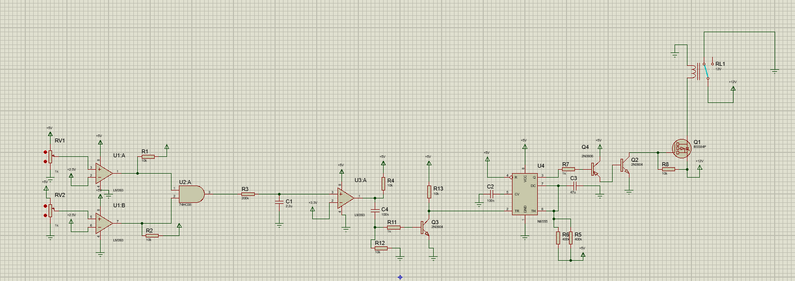
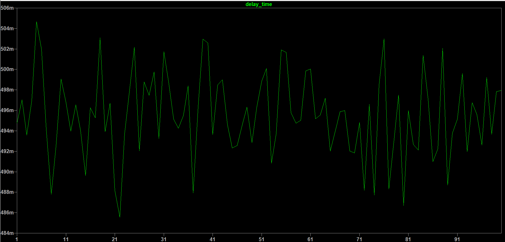

# Brake-System-Plausibility-Device-BSPD-

## Project Overview
This repository contains the design, simulation, and hardware implementation of a **Safety-Critical** electronic module for a Formula Student vehicle. The **BSPD** is a non-programmable safety circuit designed to shut down the engine in case of conflicting driver inputs, strictly following Formula Student regulations.

---

##  Hardware Architecture & Design Features
Unlike basic academic projects, this BSPD was engineered for the harsh environment of a racing vehicle, focusing on reliability and field-adjustability.

### 1. High-Side Switching & Automotive Grade Components
* **Switching Logic:** Implemented a **High-Side Switching** topology for the shutdown path. This provides superior protection against short-to-ground faults compared to low-side switching.
* **Relay Selection:** Utilized a **professional automotive-grade relay** specifically rated for high vibration and mechanical shock resistance. This ensures the safety loop remains intact despite the extreme G-forces and vibrations of the race car.

### 2. Real-World Calibration (Threshold Tuning)
* **Dual Precision Potentiometers:** The PCB features two onboard potentiometers to allow for track-side calibration. 
* **Comparator Logic:** These potentiometers set the reference voltages for the primary comparators, which monitor:
    * **TPS (Throttle Position Sensor):** Comparing the pedal travel against the >25% threshold over idle.
    * **Brake Pressure Sensor:** Comparing hydraulic pressure against the braking threshold.
* **Flexibility:** This design allows the team to fine-tune the system's sensitivity based on different driver preferences or sensor characteristics without redesigning the hardware.

---

##  Design & Reliability Simulations

### Functional Verification 
The entire analog logic—including signal conditioning, comparator stages, and the **500ms RC delay **—was validated in LTSpice  to ensure timing accuracy.

### Monte Carlo Tolerance Analysis
To ensure 100% reliability in "Worst-Case" scenarios, I performed a **Monte Carlo simulation**. By varying component tolerances ( 1% for resistors and 20% for capacitors), I verified that the trip-time always stays within the 450ms–550ms window, ensuring the car passes technical inspection regardless of component drift or thermal conditions.

